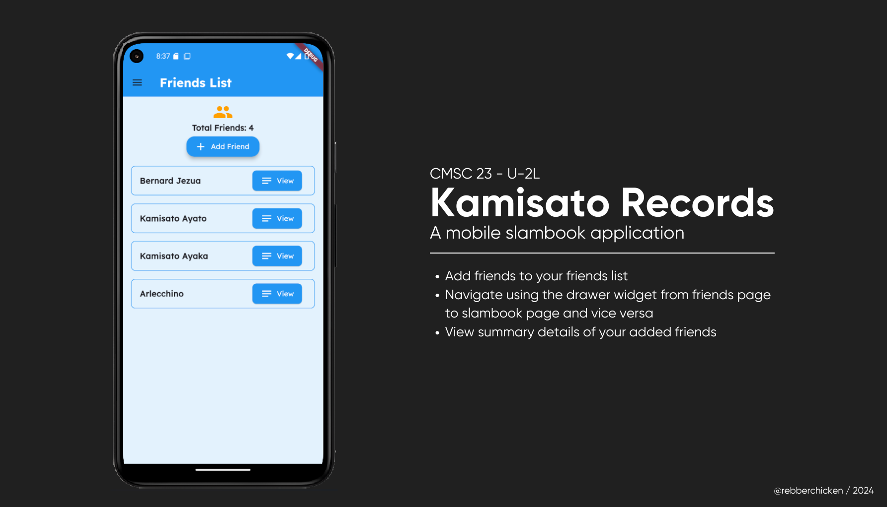
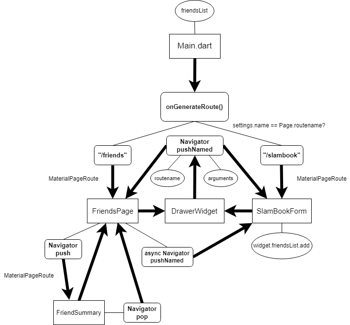

# Kamisato Records

## Code Description



This Flutter application is a slambook application that allows users to add and view details of their friends. I revolved around the theme of Genshin Impact, which is similar to my previous exercise. The application uses Flutter's `Navigator` for the backend routing and navigation, and `ThemeData` for frontend styling of UI elements (primaryColor, scaffoldBackgroundColor, textTheme, appBarTheme, and inputDecorationTheme).

## Features
1. **Style Experimentation**: From the previous exercise, I decided to try out a light blue colored theme for the entire UI. Most containers, buttons, and columns have adjusted styles like rounded corners, centered icons, and text.
2. **Custom Font Integration**: I imported the Lexend font using the Google Fonts package to replace the default font (Flutter.dev, 2024).
3. **RegEx & Catching Same Names**: Implemented a RegEx checker for _whitespace only cases_ `(e.g. "  ")` of Names and Nicknames and catch for submitting forms that have the same name already. It can be assumed that one person cannot have the same name.
4. **Dynamic List Generation**: I utilized the `ListView.builder` to dynamically generate the current list of friends. 
5. **Friend Summary Screen**: Created a `FriendSummary` stateless widget to display detailed information about a selected friend.
6. **Backend Routing**: Added navigations and centered its `Navigator.pushNamed` functions around the `DrawerWidget` in `drawer.dart`. The `SlamBookForm` is responsible for adding friends using `widget.friendsList.add`.

### Routing Layout



### How to Run Code
- Open Command Prompt or Windows Powershell.
- Navigate to the project directory.
- Run the following lines:
```sh
cd kamisato
flutter emulator --launch "Pixel_API"
flutter run
```

### Sample Run


## References

- Dalwadi, D. (2022, June 24). Flutter Navigation Guide - Push(), Pop() with all required method variants. Medium. https://darshan-dalwadi.medium.com/flutter-navigation-guide-62edb5ab04ec
- GeeksforGeeks. (2020, June 2). Routes and Navigator in Flutter. GeeksforGeeks. https://www.geeksforgeeks.org/routes-and-navigator-in-flutter/
- Google for Developers. (2023). Python Regular Expressions. https://developers.google.com/edu/python/regular-expressions
- Kumar, A. (2024, March 19). Resolving the “type ‘Null’ is not a subtype of type ‘String’” Error in Flutter. DevOps Support. https://www.devopssupport.in/blog/1834-2/
- Ntu.edu.sg. (2018). Regular Expression (Regex) Tutorial. https://www3.ntu.edu.sg/home/ehchua/programming/howto/Regexe.html
- Soni, S. (2021, November 3). How to use custom fonts in Flutter. LogRocket Blog. https://blog.logrocket.com/use-custom-fonts-flutter/
